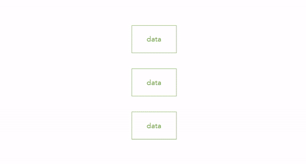
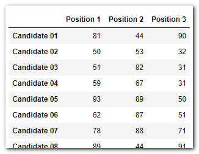
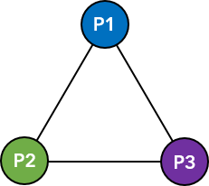
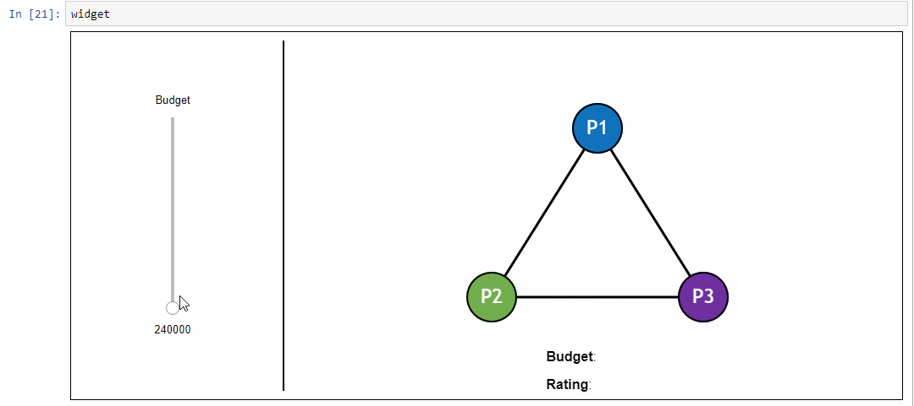
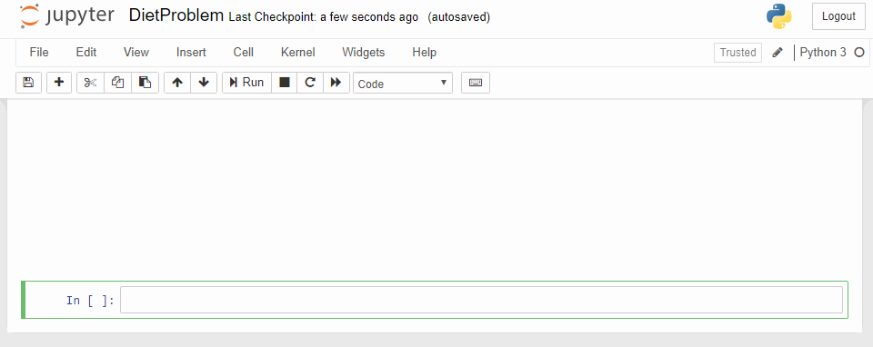

<div align="center">
  
</div>

<div align="center">

[ ](https://www.python.org/)
[](https://github.com/sassoftware/sasoptpy/issues) <br>
[](https://github.com/sassoftware/sasoptpy/releases)
[](https://github.com/sassoftware/sasoptpy/releases)
[](https://github.com/sassoftware/sasoptpy/tags) <br>
[](https://github.com/sassoftware/sasoptpy/blob/master/LICENSE)
[](https://communities.sas.com/t5/Mathematical-Optimization/bd-p/operations_research)
[](https://mybinder.org/v2/gh/sassoftware/sasoptpy/master)
</div>

## Overview

sasoptpy is the Python interface for SAS Optimization and SAS/OR solvers. It enables developers to quickly formulate and solve mathematical optimization problems by using native Python data structures. sasoptpy works with both client-side and server-side data, and it allows concurrency, making it a great tool for working with both small and large projects.

## Features

- Supports several optimization problem types:
  - Linear optimization (LP)
  - Mixed integer linear optimization (MILP)
  - Nonlinear optimization (NLP)
  - Quadratic optimization (QP)
- Works with both client-side and server-side data
- Allows abstract modeling with run-time actions
- Supports workspaces, enabling you to run multiple problems concurrently
- Provides wrapper for tuning MILP solver parameters

## Flow

#### Concrete Model

<div align="center">
	
</div>

Using native Python functionality, you can model an optimization problem on the client and solve it in SAS Viya or SAS 9.4.
The problem is fully generated on the client side, and the computationally expensive part is handled by the optimization solver.

#### Abstract Model

<div align="center">
	
</div>

If you have the data available on the server, you can model an abstract problem and cut the model generation time significantly.
You can also benefit from solving several problems concurrently.

## Installation

You can install sasoptpy via PyPI, via Conda, or by cloning from the repository.

- PyPI

  ``` sh
  pip install sasoptpy
  ```

- Conda

  ``` sh
  conda install -c sas-institute sasoptpy
  ```

- Repository

  ``` sh
  git clone https://github.com/sassoftware/sasoptpy.git
  cd sasoptpy/
  python3 setup.py install
  ```

## Examples

### 1. Team Selection Problem


<a href="#">

</a>

In many team sports, such as soccer, basketball, and e-sports, a common task is to choose team members from the pool of available players. In the following example, consider a generic problem, where the decision maker is trying to sign three players from hundreds of candidates. The objective is to maximize the total rating of the team.

The problem summary is as follows:

  - Data
    - List of players along with their attributes, desired position(s), and contract price
    - Budget limit
  - Decision
    - Choosing a player to sign for each position
  - Constraints
    - Total signing cost should not exceed the budget limit
    - Players can play only their desired position

<div align="center">
  
</div>


**Objective** is to maximize the team rating. The team rating is the quadratic sum of position pair ratings.

<div align="center">
  
</div>

<div align="center">
  
</div>


[Jupyter notebook](https://github.com/sassoftware/sasoptpy/blob/master/examples/notebooks/TeamSelection.ipynb) shows how this problem is solved using a simple linearization and the SAS Optimization MILP solver. [(nbviewer)](https://nbviewer.jupyter.org/github/sassoftware/sasoptpy/blob/master/examples/notebooks/TeamSelection.ipynb)

<div align="center">
  <a href="https://nbviewer.jupyter.org/github/sassoftware/sasoptpy/blob/master/examples/notebooks/TeamSelection.ipynb">
  
  </a>
</div>


### 2. Diet Problem

The diet problem, also known as the Stigler diet problem, is one of the earliest optimization problems in the literature. George J. Stigler originally posed the question of how to find the cheapest diet while satisfying the minimum nutritional requirements (Stigler 1945).

This well-known problem can be solved easily with linear optimization. Because the methodology had not been developed in 1937, Stigler solved this problem by using heuristics. And although his solution was not the optimal (best) solution, he missed the best solution by only 24 cents (per year).

You can see how this problem can be written in terms of mathematical equations and fed into SAS Optimization solvers by using the modeling capabilities of the sasoptpy package in [Jupyter Notebook](https://github.com/sassoftware/sasoptpy/blob/master/examples/notebooks/DietProblem.ipynb). [(nbviewer)](https://nbviewer.jupyter.org/github/sassoftware/sasoptpy/blob/master/examples/notebooks/DietProblem.ipynb)

<div align="center">
  <a href="https://nbviewer.jupyter.org/github/sassoftware/sasoptpy/blob/master/examples/notebooks/DietProblem.ipynb">
  
  </a>
</div>

<br>
<div align="center">
  <a href="https://sassoftware.github.io/sasoptpy/examples/examples.html"></a>
</div>


## Contributions

We welcome all contributions, including bug reports, new features, documentation fixes, performance enchancements, and new ideas.

If you have something to share, we accept pull requests on Github. See the [Contributing Instructions](CONTRIBUTING.md) for more details. See the [Contributor Agreement](ContributorAgreement.txt) for more details about our code of conduct.

## Tests

Unit tests are mainly intended for internal testing purposes. If your environment variables are set, you can use `unittest` to test the health of a commit or to test the code coverage. See [tests README](tests/README.md) for more details.

## Documentation

The official documentation is hosted at Github Pages: https://sassoftware.github.io/sasoptpy/.

A PDF version is also available: https://sassoftware.github.io/sasoptpy/sasoptpy.pdf.

The documentation is automatically generated using [Sphinx](https://www.sphinx-doc.org/en/master/). All class, method, and function APIs are provided in the source code. The main structure can be found in the `doc` folder.

## License

This package is published under Apache 2.0 license. See [LICENSE](LICENSE.md) for details.


---


Copyright © SAS Institute Inc.
