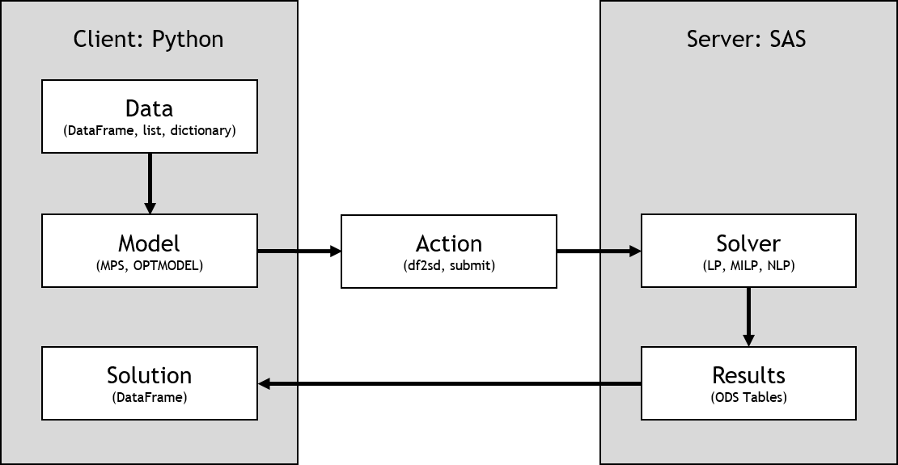
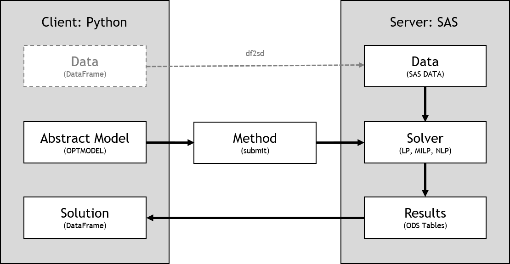

.. currentmodule:: sasoptpy

.. ipython:: python
   :suppress:

   hostname = os.getenv('CASHOST')
   port = os.getenv('CASPORT')

.. _workflows:

Workflows
=========

*sasoptpy* can work both with client-side data and server-side data.
Some limitations to the functionalities may apply in terms of which
workflow is being used. In this part, overall flow of the package
is explained.

Client-side models
------------------

If the data is on the client-side (Python), then a concrete model is generated
on the client-side and uploaded using one of the available CAS actions.

Using client-side models brings several advantages, such as accessing
variables, expressions, and constraints directly. You may do more intensive 
operations like filter data, sort values, changing variable values,
and print expressions more easily.

There are two main disadvantages of working with client-side models.
First, if your model is relatively big size, then the generated
MPS DataFrame or OPTMODEL codes may allocate a large memory on your
machine.
Second, the information that needs to be passed from client to server
might be bigger than using a server-side model.

See the following representation of the client-side model workflow for CAS (Viya) servers:

.. image:: ../_static/images/clientside_cas.png

See the following representation of the client-side model workflow for SAS clients:

Steps of modeling a simple Knapsack problem are shown in the following subsections.

Reading data
++++++++++++

.. ipython:: python

   import sasoptpy as so
   import pandas as pd
   from swat import CAS
   
   session = CAS(hostname, port)
   m = so.Model(name='client_CAS', session=session)

   data = [
       ['clock', 8, 4, 3],
       ['mug', 10, 6, 5],
       ['headphone', 15, 7, 2],
       ['book', 20, 12, 10],
       ['pen', 1, 1, 15]
       ]
   
   df = pd.DataFrame(data, columns=['item', 'value', 'weight', 'limit'])
   ITEMS = df.index
   value = df['value']
   weight = df['weight']
   limit = df['limit']
   total_weight = 55

.. ipython:: python
   
   print(type(ITEMS), ITEMS)

.. ipython:: python

   print(type(total_weight), total_weight)

Here, instead of using :meth:`Model.read_table` method, column values can be obtained
one by one:

>>> df = df.set_index('item')
>>> ITEMS = df.index.tolist()
>>> value = df['value']
>>> weight = df['weight']
>>> limit = df['limit']

Model
+++++

.. ipython:: python

   # Variables
   get = m.add_variables(ITEMS, name='get', vartype=so.INT, lb=0)
   
   # Constraints
   m.add_constraints((get[i] <= limit[i] for i in ITEMS), name='limit_con');
   m.add_constraint(
       so.quick_sum(weight[i] * get[i] for i in ITEMS) <= total_weight,
       name='weight_con');
   
   # Objective
   total_value = so.expr_sum(value[i] * get[i] for i in ITEMS)
   m.set_objective(total_value, name='total_value', sense=so.MAX);
   
   # Solve
   m.solve(verbose=True)

Using :code:`verbose` option shows the generated OPTMODEL code.
Here, we can see the coefficient values of the parameters inside the model.

Parsing results
+++++++++++++++

After the solve, primal and dual solution tables are obtained. We can print
the solution tables using the :meth:`Model.get_solution` method.

It is also possible to print the optimal solution using
the :func:`get_solution_table` function.

.. ipython:: python

   print(m.get_solution())

.. ipython:: python
   
   print(so.get_solution_table(get, key=ITEMS))

.. ipython:: python

   print('Total value:', total_value.get_value())

Server-side models
------------------

If the data is on the server-side (CAS or SAS), then an abstract model
is generated on the client-side. This abstract model is later converted to
PROC OPTMODEL code, which combines the data on the server.

The main advantage of the server-side models is faster upload times compared
to client-side. This is especially very noticable when using large chunks of
variable and constraint groups.

The only disadvantage of using server-side models is that variables often need 
to be accessed directly from the resulting SASDataFrame objects. Since
components of the models are abstract, accessing objects directly is often
not possible.

See the following representation of the server-side model workflow for CAS (Viya) servers:

.. image:: ../_static/images/serverside_cas.png

See the following representation of the server-side model workflow for SAS clients:

In the following subsections, the same example will be solved using server-side
data.

Model
+++++

.. ipython:: python

   from sasoptpy.actions import read_data

   m = so.Model(name='client_CAS', session=session)
   cas_table = session.upload_frame(df, casout='data')
   ITEMS = m.add_set(name='ITEMS', settype=so.STR)
   value = m.add_parameter(ITEMS, name='value')
   weight = m.add_parameter(ITEMS, name='weight')
   limit = m.add_parameter(ITEMS, name='limit')
   m.include(read_data(
      table=cas_table, index={'target':ITEMS, 'key': 'item'},
      columns=[value, weight, limit]))

   # Variables
   get = m.add_variables(ITEMS, name='get', vartype=so.INT, lb=0)
   
   # Constraints
   m.add_constraints((get[i] <= limit[i] for i in ITEMS), name='limit_con');
   m.add_constraint(
       so.quick_sum(weight[i] * get[i] for i in ITEMS) <= total_weight,
       name='weight_con');
   
   # Objective
   total_value = so.quick_sum(value[i] * get[i] for i in ITEMS)
   m.set_objective(total_value, name='total_value', sense=so.MAX);
   
   # Solve
   m.solve(verbose=True)

Parsing results
+++++++++++++++

.. ipython:: python

   # Print results
   print(m.get_solution())

.. ipython:: python

   print('Total value:', m.get_objective_value())

Since there is no direct access to expressions and variables, the optimal
solution is printed using the server response.

Limitations
-----------

- Nonlinear models can only be solved using runOptmodel action, hence
  requires SAS Viya version to be greater than or equal to 3.4.
- User defined decomposition blocks are only available in MPS mode, hence
  only works with client-side data.
- Mixed usage (client-side and server-side data) may not work in some cases.
  A quick fix would be transferring the data, in either direction.
